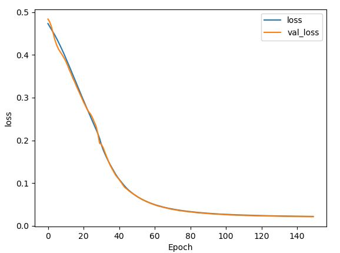

# trARPES-extraction
## ML model for extracting electronic bands (or excitonic signals) from noisy time- and angle-resolved photoemission spectra (trARPES)

It is adapted from the paper by Peng et al. [Review of Scientific Instruments 91, 033905 (2020)](https://aip.scitation.org/doi/full/10.1063/1.5132586) to deal with trARPES spectra, which are much noisier than equilibrium ARPES spectra.

The simulated ARPES spectra are obtained from a bilayer graphene lattice into which the hopping parameters are changed randomly, between values very far from the actual values for bilayer graphene so that the bands produced are very diverse. The E-k bands are computed with the [pybinding package] (https://docs.pybinding.site/en/stable/). The bands are obtained from two points chosen randomly within the first Brillouin zone.

There are two files for producing simulated ARPES spectra (Feature_ARPES_generation_main.py and Feature_ARPES_generation_utils.py) and two files for training the CNN  model (Feature_ARPES_CNN_main.py and Feature_ARPES_CNN_utils.py).

Typically, a few thousands training spectra are enough to train a model. The models are UNet type. You can choose the type in Feature_ARPES_CNN_main.py (`model_num`).

I have applied this technique to trARPES on semiconductor. In this case, excited states in or close to the conduction band are separated from the valence band and I have trained two different models: one for the valence band bare band extraction and one for the excited state signal extraction.

### Valence band model

For the valence band model, here are the parameters I used:

`
k_reso = 128
E_reso = 128
#number of bands
num_bands_min_to_delete, num_bands_max_to_delete = 0,4
label = 0
#number of spectra to make
num_spectra = 2000
#parameters limits
t0_min, t0_max = 1, 25      # [eV] nearest neighbour hopping
t1_min, t1_max, t3_min, t3_max, t4_min, t4_max = 0.5, 5, 0.5, 5, 0.5, 5
U_min, U_max = 0, 3
p1x_min, p2x_min, p1y_min, p2y_min = -20, -20, -20, -20
p1x_max, p2x_max, p1y_max, p2y_max = 20, 20, 20, 20
#HWHM of the gaussian for the Voigt, in pixels
alpha_min, alpha_max, gamma_min, gamma_max = 1,10,1,10
#For the added noise and curvature
E_c_min, E_c_max, k_c_min, k_c_max = 0, E_reso, 0, k_reso
a_b_ratio_min, a_b_ratio_max = 0, 2
amp_min, amp_max = 0,1
noise_min, noise_max = 0.0, 0.05
kT_min, kT_max = E_reso/1, E_reso/1
#squeeze factor
squeeze_min, squeeze_max = 1, 2
#thickness gives the thickness of the bare band
# 3, 5, 7
thick = 3
#here I choose if I want the Fermi edge randomly inverted
#if set to 0, make 50% of the spectra with Fermi edge inverted.
#if set to 1, Fermi edge always in the same direction
#that is for the excited states.
#I actually don't use it now because I use high temperature and 
inver = 1`

